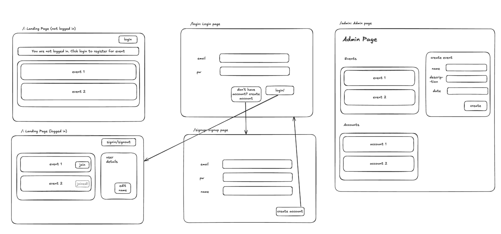

# NZPMC Registration Platform Backend

This is my first project build with MERN stack.

This is a mini registration platform which support logging, registering for events, viewing details, and an admin pane.

### wireframe



### Live Demo

https://nzpmc-registration-platform-backend.onrender.com
Note: It may take 1-3 mins because I am on free tier

### Front End code

https://github.com/Harry-Sheng/nzpmc-registration-platform-frontend

## CodeBase Structure

Front End

```
src
  assets
  components
  context
  pages
  services
  style

app.jsx
main.jsx
```

- **assets**  
   Stores images.
- **components**  
   Reusable UI components and forms that can be shared across multiple pages.
- **context**  
   Create global state for user login information using react context
- **pages**  
   Defines top-level page components. Each page corresponds to a route within the app except landingPageLogged and landingPageNotLogged they corresponds to logged/notLogged state of landing page.
- **services**  
   Encapsulates logic for interacting with APIs or back-end systems. These modules manage data fetching, authentication, and other business logic.
- **style**  
   Holds style for navigation bar. For other components I user react bootstrap so this is the only css file in this folder.
- **App.jsx**  
   The root-level component that sets up the overall structure and routing of the application.
- **main.jsx**  
   The entry point of the React application. Renders the `App` component into the DOM, initializing the app in the browser.

Back End

```
controllers
models
    event.js
    login.js
    user.js
requests
    event
    login
    user
utils
    config.js
    logger.js
    middleware.js
dist
app.js
index.js
```

- **controllers**:
  Endpoints handlers that translate HTTP requests into operations on the underlying models. For example the logic behind visit a link
- **models**:
  Data schemas and logic that interact with the mongoDB.
- **requests**:
  Tests HTTP requests
- **utils**:
  Helper functions and utilities that support cross-cutting concerns like configuration, logging, and middleware.
- **dist**:
  Frontend Production Build. Contains frontend code after build.
- **app.js**
  Initialises and configures the Express application, sets up middleware, routes, and error handling.
- **index.js**:
  The main entry point that starts the server, listening on a specified port and connecting to the database if needed.

### Extra Features

- JWT for authentication
- ReactBootstrap and css for better looking
